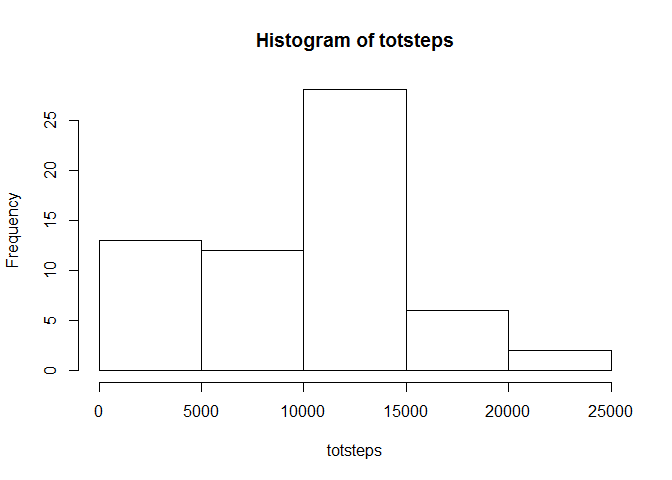
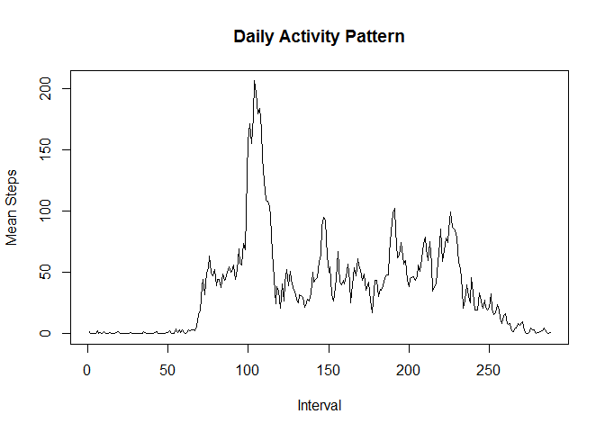
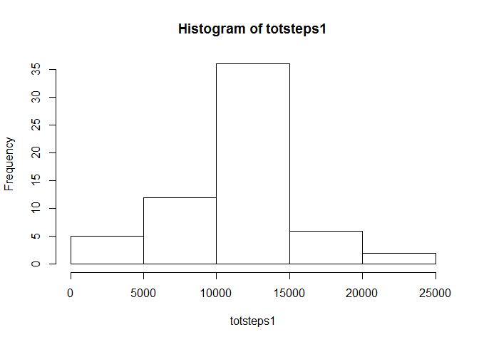
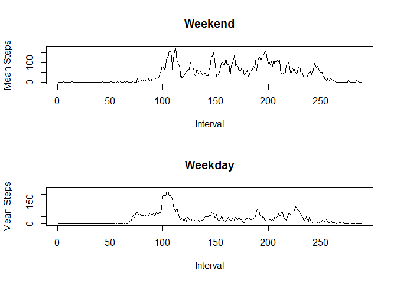

# Reproducible Research Project 1 - Activity Data

Loading and preprocessing the data


```r
dt <- read.csv("activity.csv", header = TRUE, na.strings = "NA")
```

What is the mean total number of steps taken per day?


```r
totsteps <- tapply(dt$steps, dt$date, sum, na.rm = TRUE)
hist(totsteps)
```



```r
mean(totsteps)
```

```
## [1] 9354.23
```

```r
median(totsteps)
```

```
## [1] 10395
```

What is the average daily activity pattern?


```r
daily <- tapply(dt$steps, dt$interval, mean, na.rm = TRUE)
dailydf <- data.frame(interval = names(daily), mean.steps = daily)
plot(dailydf$mean.steps, type = "n", xlab = "Interval", ylab = "Mean Steps", main="Daily Activity Pattern")
lines(dailydf$mean.steps)
```



Interval 835 contains the max average steps:

```r
dailydf$interval[dailydf$mean.steps==max(dailydf$mean.steps)]
```

```
## [1] 835
## 288 Levels: 0 10 100 1000 1005 1010 1015 1020 1025 1030 1035 1040 ... 955
```

Imputing Missing Values

Number of missing values=2304:

```r
nrow(dt[is.na(dt$steps),])
```

```
## [1] 2304
```

Using the mean of the 5-minute interval across all dates to fill in missing values.

```r
dt1mrg <- merge(dt, dailydf, by = "interval")
dt1 <- data.frame(dt1mrg, newsteps = "")
dt1$newsteps <- ifelse(is.na(dt1$steps), dt1$mean.steps, dt1$steps)
```

Histogram, mean, and median:

```r
totsteps1 <- tapply(dt1$newsteps, dt1$date, sum)
hist(totsteps1)
```



```r
mean(totsteps1)
```

```
## [1] 10766.19
```

```r
median(totsteps1)
```

```
## [1] 10766.19
```

The values are different from before. Imputing the missing values changes the data and we don't know how the results might be affected (lower, higher, skewed...).  It is better to remove NAs than to impute them.


Are there differences in activity patterns between weekdays and weekends?


```r
dt$date <- as.Date(dt$date, format = "%Y-%m-%d")
dt$day.type <- ifelse(weekdays(dt$date)=="Saturday" | weekdays(dt$date) == "Sunday",
  "Weekend", "Weekday"
)
dt$day.type <- factor(dt$day.type)
```


```r
weekends <- dt[dt$day.type=="Weekend",]
weekdays <- dt[dt$day.type=="Weekday",]

weDaily <- tapply(weekends$steps, weekends$interval, mean, na.rm = TRUE)
weDailydf <- data.frame(interval = names(weDaily), mean.steps = weDaily)

wdDaily <- tapply(weekdays$steps, weekdays$interval, mean, na.rm = TRUE)
wdDailydf <- data.frame(interval = names(wdDaily), mean.steps = wdDaily)

par(mfrow=c(2,1))
plot(weDailydf$mean.steps, type = "n", xlab = "Interval", ylab = "Mean Steps", main = "Weekend")
lines(weDailydf$mean.steps)
plot(wdDailydf$mean.steps, type = "n", xlab = "Interval", ylab = "Mean Steps", main = "Weekday")
lines(wdDailydf$mean.steps)
```



Weekends have consistently higher step counts throughout the day, but Weekdays have a spike around interval 100.
